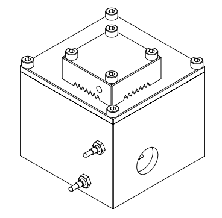
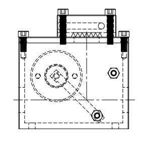

# LASER4DIY Laser Shutter

This is the repository is part of the [Laser4DIY project](http://www.laser4diy.org/).

## Specs 

The laser shutter was designed for CO2 glass tube laser sources typically used in laser cutters, with a power of no more than 50W. The shutter itself is made of copper which has a high reflectivity at the wave length of ~10µm. For other wave lengths this is design cannot be used.
For a laser shutter to be effective, it has to be integrated into the machine safety concept. The electronics circuit that is included in this documentation can only serve as an example and has to be adapted to your needs.

Please note that this documentation is distributed without any express or implied warranty. Use it at your own risk. Please also read the details of the CERN-OHL license.

## License

This hardware documentation is licensed under CERN-OHL-P v2.

---

Copyright FabLab München e.V.  2021.

Laser4DIY is sponsored by the Federal Ministry of Education and Research

This source describes Open Hardware and is licensed under the CERN-OHL-P v2

You may redistribute and modify this documentation and make products using it 
under the terms of the CERN-OHL-P v2 (https:/cern.ch/cern-ohl).
This documentation is distributed WITHOUT ANY EXPRESS OR IMPLIED WARRANTY, 
INCLUDING OF MERCHANTABILITY, SATISFACTORY QUALITY AND FITNESS FOR A  PARTICULAR 
PURPOSE. Please see the CERN-OHL-P v2 for applicable conditions

